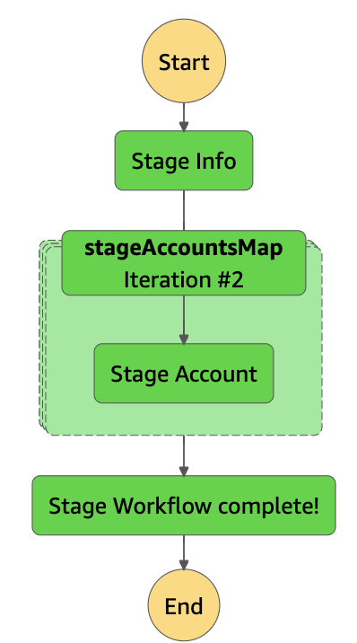

## Disclaimer: 
This is not an official repo. It is just for the general guidance. AWS stack in this blog post is provided as-is, use it as a general guidance. For AWS you are responsible for everything including all the expenses incurred and security aspects. 

## About 
This CDP starter pack solution for ISVs is designed to run in your AWS environment. It is completely optional to use this for your implementation. 

## Design consideration  

> Supports csv format only  
> Supports full refresh only  

## Pre-requisite   
On your local machine, if you do not have npm or AWS CDK…  
Install npm by running the command “npm install -g npm”  
Install AWS CLI by running command “npm install -g aws-cdk”  

From command line:  
Run “AWS configure” (<a href="https://docs.aws.amazon.com/IAM/latest/UserGuide/id_credentials_access-keys.html"> use your IAM credentials for this. Check the section Managing access keys (console))</a>  
Run the command “cdk bootstrap aws://YOUR-AWS-ACCOUNT-NUMBER/us-east-1” (replacing YOUR-AWS-ACCOUNT-NUMBER with your AWS account number)

## Key components
> 3 S3 buckets  
- IN_BUCKET Stores incoming activation files (sent by salesforce CDP) 
- STAGE_BUCKET Stores the incoming data in an easy to digest csv) and results of the activation processing 
- FAKE_BUCKET Stores fake (incoming) activation files (Created by fake step function)

> 2 Step functions (workflows)  
- "stage": Processes incoming zip files by reading from EXISTING_BUCKET/IN_BUCKET, segment json file, s3 directory path and it outputs easy to ingest csv files for each account, under the "stage" folder in the STAGE_BUCKET. 
- "fake": Generates fake data for testing the stage function

> 5 lambda functions  
- "stage-info.py": Gets the information from incoming data bucket
- "stage-account.py": Gets the information from incoming data bucket
- "fake-info.py": Gets the information from incoming data bucket
- "fake-account.py": Gets the information from incoming data bucket
- "summary.py" (Optional): Creates a summary data for analytics. You can implement aggregation using pandas

> Daily schedule that calls stage step function. You can change the schedule or disable the batch run under EventBridge

> IAM permissions for S3 buckets, Step functions and Lambda functions

> IAM user that you can use to connect to summary bucket for the analytics

## Install the stack and implement plug-in logic. This assumes you have basic AWS knowledge
1. In the AWS console, change the region to us-east-1 (This is located in the top second right menu item).
- Go to AWS Services → CloudFormation → Stacks
- Click "Create stack" with the option "With new resources (standard)", use the S3 URL 
https://cdp-pub-us-east-1.s3.amazonaws.com/CdpAwsStack.template.json
- Name the stack "cdp", if you already have an existing bucket that is configured to receive incoming CDP activation files then enter the name of the bucket in the parameter text field "CDPBUCKETNAME" (This will be used for EXISTING_BUCKET), select all other defaults, and create the stack. 
2. Go to AWS Services → Lambda
Open the stage.py and implement the activation code in the placeholder and click deploy   
3. Test... run stage.py Lambda functions by clicking "Test" button

## Note about the names of the generated CDK components e.g. S3 bucket, Step functions, Lambda functions etc  
- In AWS, S3 bucket name has to be unique across the account in a given region  
- You will see s3 buckets, Step functions, Lambda functions etc with prefix and suffix e.g. cdp-stage***  

## Generate fake data and test the stage function
> Go to AWS Services → Step functions  
- Go to fake step function  
      
- Click execute step function  
  
- Pass the sample json which will create test data i.e. following example will create, 3 accounts with 3 segements for each account and 6 activations for each segment. Chuck size is the number of records in each zip file  
{
	"total_accounts": 3,
	"total_segments" : 3,
    "total_activations" : 6,
    "chunk_size": 4
}  
- Once the step function execution completes, you should see the data in the FAKE_BUCKET  
  

- Now Go to the 'stage' step function  
     
- Click execute step function  
  
- Pass following json as a payload (which indicates stage function to pick data from FAKE_BUCKET instead of real data in the IN_BUCKET)  
{
	"fake": 'fake'
}  

- Once the step function execution completes processing test data from FAKE_BUCKET, you should see the results in the STAGE_BUCKET  
  

## Test the stage function with real incoming data from CDP
>  Go to the 'stage' step function  
     
- Click execute step function without passing any payload and this will process data from IN_BUCKET. Once the step function execution completes processing test data from IN_BUCKET, you should see the results in the STAGE_BUCKET  

## Customizing the Lambda functions for your needs  
> To implement your activation logic. Go to AWS Services → Lambda  
- Open the 'stage-account' function, plug in the logic replacing "Partner TODO here"  
- Click deploy   
- Next time you run the step function it will pick up the updated lambda function.   
> You can update the logic as per your need as this is a starter pack  

## If you decide not to use the starter pack, cleanup the AWS stack  
- Go to AWS Services → CloudFormation → Stacks  
- Select the CDP stack and click delete  

## Optional: (Advance aws users) If you wish to build and run on local machine. This assumes you have more than basic knowledge of AWS. 

1. For building and running on local machine. Get aws IAM credentials and configure the key and secret. Best practice is to not to use root AWS user. Create an user with appropriate permissions e.g. S3, Step functions, Cloudformation, Lambda, EventBridge perms
```
aws configure
```

2. Install node.js if you don't have already. Run following commands...
```
npm cache clear --force
npm install aws-sdk
npm install
```

3. Install python 3.8 if you don't have already. Run following commands...
```
pip3 install boto3
pip3 install pandas
```

4. Modify Step functions and/or Lambda functions as per the needs" 

5. For testing on local machine, you can export the variables

```
export AWS_REGION=us-east-1
export IN_BUCKET=***
export STAGE_BUCKET=***
export EXISTING_BUCKET=***
export FAKE_BUCKET=***
```
e.g.
export IN_BUCKET=
export STAGE_BUCKET=cdpstage
export EXISTING_BUCKET=partner-kam-data-in-csv-1-s

6. Deploy the stack to your aws instance
```
cdk synth
cdk deploy
```
